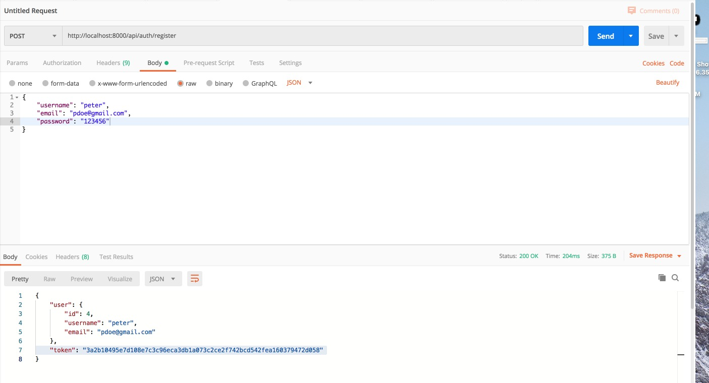
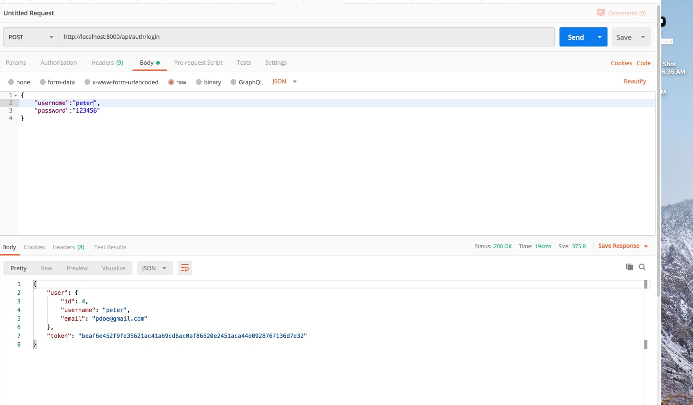
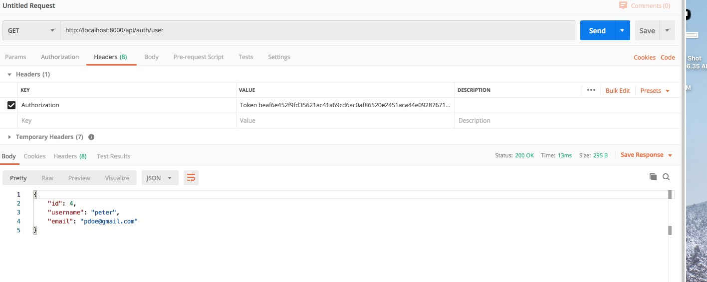

## Waste Tracking Project

A web application that allows user to log in and track where their organic waste is going.
 
### Environment Set up
The backend is written in Django rest framework. Execute the following commands to create the virtual environnent for this project.  

(1) Check python version. This project uses Python 3.6.  If you do not have Python, please install the latest 3.x version from python.org. After you install Python, in terminal, run: 

`python3 --version`

(2) Pipenv is a tool used to create Python virtual environment. If you don't have that installed, you can install it by running: 

`pip3 install pipenv`

(3) Now that you have pipenv, run:

`pipenv install --dev`

This will all the dependencies needed for development, as specified in Pip.lock file.

###End points: 
User Register  
http://localhost:8000/api/auth/register  
 
 
User Login  
http://localhost:8000/api/auth/login    
 

Look up User by Token  
http://localhost:8000/api/auth/user  

